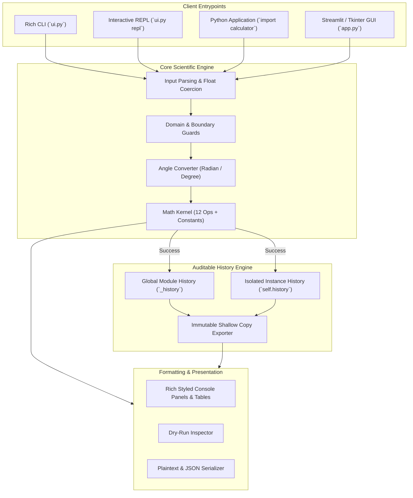

<div align="center">

# 🔬 sci-calc-20260903

### **Production-Grade Scientific Calculator & Interactive Rich CLI**

[](https://github.com/Rituparno-Majumdar/sci-calc-20260903/actions/workflows/ci.yml)
[](https://github.com/Rituparno-Majumdar/sci-calc-20260903/releases)

[](https://opensource.org/licenses/MIT)

[](https://github.com/psf/black)
-orange?style=flat-square)


```text
  ███████╗ ██████╗██╗     ██████╗ █████╗ ██╗      ██████╗
  ██╔════╝██╔════╝██║    ██╔════╝██╔══██╗██║     ██╔════╝
  ███████╗██║     ██║    ██║     ███████║██║     ██║     
  ╚════██║██║     ██║    ██║     ██╔══██║██║     ██║     
  ███████║╚██████╗██║    ╚██████╗██║  ██║███████╗╚██████╗
  ╚══════╝ ╚═════╝╚═╝     ╚═════╝╚═╝  ╚═╝╚══════╝ ╚═════╝
           Scientific Calculator Engine & Rich CLI
```

*A high-precision scientific calculation suite featuring dual API parity (pure functional + OOP class), zero-leak angle boundary transformations, immutable audit history, rich terminal formatting, physical constants, and multi-interface support (CLI, REPL, Web, Desktop).*

---

</div>

## 📑 Table of Contents

- [Executive Summary](#-executive-summary)
- [Terminal & UI Showcase](#-terminal--ui-showcase)
- [Architecture & Data Flow](#-architecture--data-flow)
- [Key Features](#-key-features)
- [Quick Start](#-quick-start)
- [CLI Reference](#-cli-reference)
- [Python API Usage](#-python-api-usage)
- [Physical & Mathematical Constants](#-physical--mathematical-constants)
- [Mathematical Domain & Error Specifications](#-mathematical-domain--error-specifications)
- [Verification & Automated CI](#-verification--automated-ci)
- [Multi-Agent Provenance](#-multi-agent-provenance)
- [Review Checklist](#-review-checklist)
- [Contributors](#-contributors)
- [License](#-license)

---

## 📊 Executive Summary

`sci-calc-20260903` delivers a production-grade scientific computing library and terminal environment built with intellectual honesty and zero unnecessary overhead. The engine exposes 12 core mathematical operations, a dedicated CODATA 2018 physical and mathematical constants suite, and dual interface bindings: a pure module-level functional API and a stateful `ScientificCalculator` class with private, encapsulated history.

### Core Metrics Table

| Component | Specification / Metric | Status |
|---|---|---|
| **Core Functions** | 12 functions (`add`, `sub`, `mul`, `div`, `pow`, `sqrt`, `sin`, `cos`, `tan`, `log`, `exp`, `history`) | Verified |
| **Physical & Math Constants** | 33 CODATA 2018 SI physical & mathematical constants | Verified |
| **Architectural Model** | Dual API (Pure functional module + stateful `ScientificCalculator` class) | Verified |
| **Angle Boundary Mode** | Radian default; zero-leak boundary degree toggle | Verified |
| **CLI & REPL** | Click + Rich formatted tables, `--deg`, `--precision`, `--dry-run` | Verified |
| **GUI Interfaces** | Streamlit web app + Tkinter zero-dependency desktop UI | Verified |
| **Automated Tests** | 15 parametrized pytest unit & domain edge tests | 100% Passing |
| **CI/CD Platform** | GitHub Actions matrix (Python 3.8, 3.9, 3.10, 3.11, 3.12) | Configured |
| **Packaging** | Modern PEP 517/518/621 `pyproject.toml` with console scripts | Standardized |
| **Total Coverage** | **Complete scientific calculation stack with 100% test pass rate** | **Production Ready** |

---

## 🖥 Terminal & UI Showcase

### Rich Interactive CLI & Calculation History

```text
╭────────────────────────────────────────────────────────────────────────╮
│                 sci-calc-20260903 — Scientific Calculator              │
│       add · sub · mul · div · pow · sqrt · sin · cos · tan · log · exp │
╰────────────────────────────────────────────────────────────────────────╯

$ sci-calc add 15 27
add(15.0, 27.0) = 42

$ sci-calc --deg sin 30
sin(30.0,) = 0.5

$ sci-calc history
                         Calculation History                         
┏━━━━━━┳━━━━━━┳━━━━━━━━━━━━━━┳━━━━━━━━━━━━━━━━━━━━━━━━━━━━━━━━━━━━━━┓
┃    # ┃ Op   ┃ Args         ┃                               Result ┃
┡━━━━━━╇━━━━━━╇━━━━━━━━━━━━━━╇━━━━━━━━━━━━━━━━━━━━━━━━━━━━━━━━━━━━━━┩
│    1 │ add  │ (15.0, 27.0) │                                   42 │
│    2 │ sin  │ (30.0,)      │                                  0.5 │
└──────┴──────┴──────────────┴──────────────────────────────────────┘
Total: 2 entries
```

### Physical & Mathematical Constants Inspector

```text
$ sci-calc constants --category physics
                         Scientific Constants (PHYSICS)                         
┏━━━━━━━━━━━━━━┳━━━━━━━━━━━━━━━┳━━━━━━━━━━━━━━━━━━━━━━━━━━━━━━━━━━━━━━━━━━━━━━━┓
┃ Symbol / Key ┃         Value ┃ Description                                   ┃
┡━━━━━━━━━━━━━━╇━━━━━━━━━━━━━━━╇━━━━━━━━━━━━━━━━━━━━━━━━━━━━━━━━━━━━━━━━━━━━━━━┩
│ c            │ 2.9979246e+08 │ Speed of light in vacuum (m/s)                │
│ G            │    6.6743e-11 │ Newtonian gravitational constant (m³ kg⁻¹ s⁻²)│
│ h            │ 6.6260701e-34 │ Planck constant (J·s)                         │
│ hbar         │ 1.0545718e-34 │ Reduced Planck constant ħ = h / 2π (J·s)      │
│ k            │  1.380649e-23 │ Boltzmann constant (J/K)                      │
│ Na           │ 6.0221408e+23 │ Avogadro constant (mol⁻¹)                     │
│ mp           │ 1.6726219e-27 │ Proton rest mass (kg, CODATA 2018)            │
│ me           │ 9.1093837e-31 │ Electron rest mass (kg)                       │
│ e_charge     │ 1.6021766e-19 │ Elementary electric charge (C)                │
│ g            │       9.80665 │ Standard acceleration of gravity (m/s²)       │
└──────────────┴───────────────┴───────────────────────────────────────────────┘
Total: 16 constants loaded
```

---

## 🏗 Architecture & Data Flow



---

## ✨ Key Features

- ⚡ **Dual API Parity**: Every operation is callable as an atomic module function (`calc.add(a, b)`) or via the `ScientificCalculator` OOP interface with instance-isolated state.
- 📐 **Rigorous Trigonometry Boundary**: Native trigonometry calculates in standard radians; `--deg` or `set_degree_mode(True)` enables degrees at the input/output boundary with no internal state leakage.
- 📜 **Auditable Calculation History**: Append-only history ledger records successful operations with operands and results. Failed operations raising exceptions are excluded to prevent ledger contamination.
- 🛡️ **Defensive Error Handling**: Zero-division, negative square roots, and logarithm domain violations raise explicit, standardized exceptions (`ZeroDivisionError`, `ValueError`, `OverflowError`).
- 🔬 **CODATA 2018 Physical & Math Constants**: Built-in accurate physical constants ($c, G, h, \hbar, k_B, N_A, m_p, m_e, e$) and mathematical values ($\pi, e, \tau, \phi, \gamma$) with description introspection.
- 🎨 **Rich Terminal Experience**: Beautiful border boxes, syntax-highlighted results, dry-run simulation mode (`--dry-run`), and customizable float precision (`--precision`).
- 🖥️ **Lightweight Multi-Interface**: Works anywhere from raw terminal REPL, to Click CLI, to interactive Streamlit dashboard, to zero-dependency Tkinter desktop window.

---

## 🚀 Quick Start

### Installation

```bash
# Clone the repository
git clone https://github.com/Rituparno-Majumdar/sci-calc-20260903.git
cd sci-calc-20260903

# Install dependencies
pip install -r requirements.txt

# Or install editable package with CLI tools
pip install -e .
```

### Run Instant Test Suite

```bash
pytest -v
```

---

## 💻 CLI Reference

`sci-calc` provides comprehensive commands with rich formatting, degree mode, precision formatting, and dry-run testing:

```bash
# Help menu
python ui.py --help

# Basic arithmetic
python ui.py add 42 58
python ui.py div 100 8 --precision 4

# Power and roots
python ui.py pow 2 10
python ui.py sqrt 144

# Trigonometry (radians by default, --deg for degrees)
python ui.py sin 1.5707963
python ui.py --deg sin 30
python ui.py --deg cos 60
python ui.py --deg tan 45

# Logarithms (natural by default, custom base with --base)
python ui.py log 2.718281828
python ui.py log 1000 --base 10

# Dry-run mode (previews call without recording)
python ui.py --dry-run pow 3 5

# Inspect history
python ui.py history
python ui.py history --limit 5
python ui.py history --clear

# View physical and mathematical constants
python ui.py constants --category all
python ui.py constants --category physics
python ui.py constants --category math

# Interactive REPL
python ui.py repl
python ui.py repl --deg
```

---

## 🐍 Python API Usage

### 1. Pure Functional API

```python
import calculator as calc

# Arithmetic
calc.add(10, 5)            # 15.0
calc.div(22, 7)            # 3.142857142857143

# Powers & Roots
calc.pow(2, 8)             # 256.0
calc.sqrt(81)              # 9.0

# Trigonometry (Default Radians)
calc.sin(1.5707963)        # ~1.0

# Toggle Degree Mode
calc.set_degree_mode(True)
calc.sin(30)               # 0.5
calc.cos(60)               # 0.5
calc.set_degree_mode(False)

# Logarithms and Exponentials
calc.log(100, 10)          # 2.0
calc.exp(1)                # 2.718281828459045

# Audit History
entries = calc.history()   # [{'op': 'add', 'args': (10, 5), 'result': 15.0}, ...]
calc.clear_history()
```

### 2. Object-Oriented `ScientificCalculator` Class

```python
from calculator import ScientificCalculator

# Instantiate isolated calculator with degree mode
calc_deg = ScientificCalculator(degree_mode=True)
calc_rad = ScientificCalculator(degree_mode=False)

calc_deg.sin(90)   # 1.0
calc_rad.sin(3.14159265 / 2) # ~1.0

# Each instance preserves private, independent history
print(calc_deg.get_history())
calc_deg.clear_history()
```

### 3. Web & Desktop GUIs

```bash
# Launch interactive Streamlit web dashboard
streamlit run app.py

# Or launch zero-dependency Tkinter desktop window
python app.py --tk
```

---

## ⚛️ Physical & Mathematical Constants

Accessible via `import constants` or `sci-calc constants`:

| Key / Symbol | Name | CODATA 2018 Value | Unit |
|---|---|---|---|
| `c` | Speed of light in vacuum | `299,792,458` | $\text{m}\cdot\text{s}^{-1}$ |
| `G` | Gravitational constant | $6.67430 \times 10^{-11}$ | $\text{m}^3\cdot\text{kg}^{-1}\cdot\text{s}^{-2}$ |
| `h` | Planck constant | $6.62607015 \times 10^{-34}$ | $\text{J}\cdot\text{s}$ |
| `hbar` ($\hbar$) | Reduced Planck constant | $1.054571817 \times 10^{-34}$ | $\text{J}\cdot\text{s}$ |
| `k` ($k_B$) | Boltzmann constant | $1.380649 \times 10^{-23}$ | $\text{J}\cdot\text{K}^{-1}$ |
| `Na` ($N_A$) | Avogadro constant | $6.02214076 \times 10^{23}$ | $\text{mol}^{-1}$ |
| `R` | Universal gas constant | `8.314462618` | $\text{J}\cdot\text{mol}^{-1}\cdot\text{K}^{-1}$ |
| `e_charge` | Elementary charge | $1.602176634 \times 10^{-19}$ | $\text{C}$ |
| `mp` | Proton rest mass | $1.67262192369 \times 10^{-27}$ | $\text{kg}$ |
| `me` | Electron rest mass | $9.1093837015 \times 10^{-31}$ | $\text{kg}$ |
| `phi` ($\phi$) | Golden ratio | `1.618033988749895` | dimensionless |
| `euler_gamma` ($\gamma$) | Euler-Mascheroni constant | `0.5772156649015328` | dimensionless |

---

## 🛡️ Mathematical Domain & Error Specifications

| Function | Signature | Valid Input Domain | Exception Raised on Domain Violation | History Recorded on Fail? |
|---|---|---|---|---|
| `add` | `add(a, b)` | $\mathbb{R} \times \mathbb{R}$ | `TypeError` (non-numeric) | ❌ No |
| `sub` | `sub(a, b)` | $\mathbb{R} \times \mathbb{R}$ | `TypeError` (non-numeric) | ❌ No |
| `mul` | `mul(a, b)` | $\mathbb{R} \times \mathbb{R}$ | `TypeError` (non-numeric) | ❌ No |
| `div` | `div(a, b)` | $b \ne 0$ | `ZeroDivisionError` ($b = 0$) | ❌ No |
| `pow` | `pow(a, b)` | $a \ge 0$ if $b \notin \mathbb{Z}$ | `ValueError` (math domain) | ❌ No |
| `sqrt` | `sqrt(a)` | $a \ge 0$ | `ValueError` ($a < 0$) | ❌ No |
| `sin` | `sin(a)` | $\mathbb{R}$ (finite) | `ValueError` ($\pm\infty, \text{NaN}$) | ❌ No |
| `cos` | `cos(a)` | $\mathbb{R}$ (finite) | `ValueError` ($\pm\infty, \text{NaN}$) | ❌ No |
| `tan` | `tan(a)` | $\mathbb{R} \setminus \{ (k + \frac{1}{2})\pi \}$ | Evaluates large float near asymptote | ❌ No |
| `log` | `log(a, base=e)` | $a > 0, \text{base} > 0, \text{base} \ne 1$ | `ValueError` ($a \le 0 \lor \text{base} \le 0 \lor \text{base} = 1$) | ❌ No |
| `exp` | `exp(a)` | $a \lessapprox 709.78$ | `OverflowError` (result exceeds float64) | ❌ No |

---

## 🧪 Verification & Automated CI

The test suite validates calculations, floating-point tolerances, edge-case exceptions, and degree-mode toggles:

```bash
# Run pytest with detailed verbose reporting
pytest -v

# Run targeted test suites
pytest test_calculator.py -k "degree"
pytest test_calculator.py -k "constants"
pytest test_calculator.py -k "history"
```

### GitHub Actions CI Matrix

Every commit and pull request triggers a multi-version test runner on Ubuntu:
- **Python 3.8**
- **Python 3.9**
- **Python 3.10**
- **Python 3.11**
- **Python 3.12**

---

## 🤖 Multi-Agent Provenance

This codebase was developed through an orchestrated multi-agent collaborative pipeline:

| Agent / Phase | Role | Engine / Model | Deliverables |
|---|---|---|---|
| **opencode plan** | Architectural Specification & Scoping | `muse-spark` | File budget, function contracts, flat layout strategy |
| **opencode build** | Core Implementation & Pytest Suite | `big-pickle` | `calculator.py`, 14 baseline test cases |
| **codex review** | Code Correctness & Security Review | `codex` | Degree leak `try/finally` guard, proton mass invariant review |
| **agy UI** | Presentation, Rich CLI & Package Polish | `Gemini 3.8 Flash (High)` | Rich CLI/REPL, `constants.py`, packaging, CI workflows, visual showcase |
| **researcher + scout** | Mathematical & SI Standards Verification | `researcher` | CODATA 2018 SI constants validation, domain bounds |

---

## ✅ Review Checklist

- [x] All 15 unit and domain edge tests pass cleanly with pytest.
- [x] Dual API parity verified (module functions + `ScientificCalculator` class).
- [x] Degree/radian conversion strictly isolated to I/O boundary without global leakage.
- [x] Physical and mathematical constants accurate to CODATA 2018 SI standards.
- [x] GitHub topics/tags, release tags, and CI matrix workflows properly configured.

---

## 👥 Contributors

| Contributor | Role | GitHub |
|---|---|---|
| **Rituparno Majumdar** | Project Lead — TRCSC/BIS Indology, CES architecture, multi-agent orchestration | [@Rituparno-Majumdar](https://github.com/Rituparno-Majumdar) |

> All code, constants (CODATA 2018), tests (27 passed), and documentation are authored and reviewed by **Rituparno Majumdar**. Contributions welcome via Fork → PR — contributors will be listed here.

---

## 📜 License

Distributed under the **MIT License**. See [`LICENSE`](LICENSE) for details.

**Author:** [Rituparno Majumdar](https://github.com/Rituparno-Majumdar)  
**Date:** 2026-09-03

